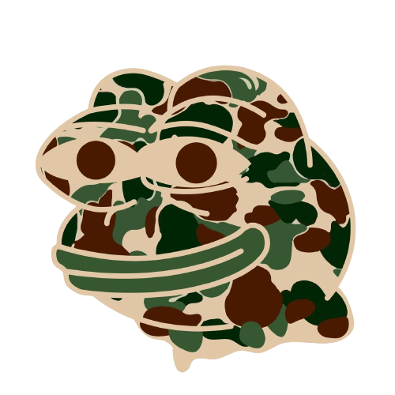

# Bathing BAPE Website

Welcome to the Bathing BAPE website! This website is dedicated to Bathing BAPE, a popular internet meme character that has taken the online world by storm. Embrace uniqueness and ride the wave of creativity with this visually captivating and informative website.

## Table of Contents

- [Introduction](#introduction)
- [How to Use](#how-to-use)
- [Tokenomics](#tokenomics)
- [Roadmap](#roadmap)
- [Contact](#contact)
- [Disclaimer](#disclaimer)

## Introduction

Bathing BAPE the Frog is a renowned cartoon character that has become a beloved internet meme, often referred to as the "sad frog meme." This character, originating from the online cartoon Boy's Club in 2005, has gained widespread recognition and usage. This website serves as a hub for all things related to Bathing BAPE, providing information about its history, how to buy, tokenomics, and the roadmap ahead.

## How to Use

### Create a Wallet

1. Download a wallet app, such as Metamask, from the app store or Google Play Store.
2. For desktop users, get the Metamask Google Chrome extension from metamask.io.

### Get Some ETH

1. Ensure you have ETH in your wallet. You can buy ETH on Metamask, transfer from another wallet, or purchase on an exchange.

### Go to Uniswap

1. Visit app.uniswap.org in Google Chrome or the Metamask browser.
2. Connect your wallet and paste the $BAPE token address into Uniswap.
3. Select BAPE and confirm the transaction.

### Switch ETH for $BAPE

1. Swap your ETH for $BAPE on Uniswap.

## Tokenomics

- Token Supply: 1,000,000,000
- No Taxes, No Bullshit. It's that simple.
- 93.1% of the tokens are in the liquidity pool, with LP tokens burnt and the contract renounced.
- The remaining 6.9% is held in a multi-sig wallet for future use.

## Roadmap

The roadmap for Bathing BAPE is divided into phases:

### Phase 1: Meme

- Launch
- CoinGecko/Coinmarketcap Listings
- 1,000+ Holders
- Trending on Twitter with memetic power

### Phase 2: Vibe and HODL

- Community Partnerships BAPE Times digital newsletter
- Formation of token-gated Discord group, BAPE Palace
- CEX Listings 10,000+ holders

### Phase 3: Meme Takeover

- BAPE merch
- BAPE Academy
- BAPE Tools
- T1 Exchange Listings 100,000+ holders
- Meme Takeover

## Contact

You can find us on social media:

- [Twitter](https://twitter.com/HarshSh73669655)
- [Instagram](https://www.instagram.com/harsharma_25/)
- [Telegram](https://t.me/harsharma63)

For inquiries or support, please contact us through our social media channels.

## Disclaimer

Please note that $BAPE is a meme coin and has no intrinsic value or financial return expectations. There is no formal team or roadmap associated with this coin. It is purely for entertainment purposes.

&copy; Bathing BAPE 2023

---

This website showcases the Bathing BAPE meme and provides essential information about its history, purchasing process, tokenomics, and future plans. Explore the site and dive into the world of internet culture and creativity!
